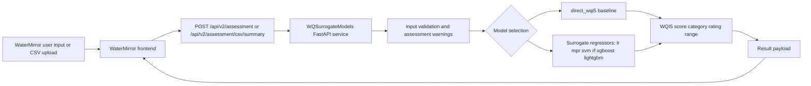

# WQSurrogateModels

[](LICENSE)
[](https://www.python.org)
[](https://github.com/KageRyo/WQSurrogateModels/actions/workflows/ci.yml)

WQSurrogateModels is a FastAPI backend for WQI5-based water quality assessment. It provides a direct WQI5 formula baseline, surrogate regression models, API endpoints, and scripts for reproducing the experiments.

It provides:

- a `direct_wqi5` baseline
- surrogate regression models
- `/api/v2/*` endpoints for [WaterMirror](https://github.com/KageRyo/WaterMirror) and other HTTP clients
- reproducibility scripts and experiment documentation

## Relationship with the Companion Repository

This project is part of a two-repository system:

- [WaterMirror](https://github.com/KageRyo/WaterMirror): cross-platform mobile frontend for data entry, CSV upload, and result visualization
- `WQSurrogateModels`: FastAPI backend and reproducibility repository for WQI5-based current-state water quality assessment

[WaterMirror](https://github.com/KageRyo/WaterMirror) depends on the API contract exposed by this repository. `WQSurrogateModels` can also be used independently through `curl`, Postman, or custom scripts.

## What This Repository Does

- serves a FastAPI backend for WQI5 assessment
- supports a `direct_wqi5` formula baseline
- supports surrogate regression models: `lr`, `mpr`, `svm`, `rf`, `xgboost`, `lightgbm`
- provides reproducibility scripts and experiment configuration
- keeps compatibility with legacy endpoints while treating `/api/v2/*` as the primary contract

## Terminology

- `direct_wqi5`: computes the WQI5 score directly from the documented formula.
- `surrogate model`: a regression model trained to approximate WQI5 scores from the same five indicators.
- `complete-input model`: a model that requires all five indicators: `DO`, `BOD`, `NH3N`, `EC`, and `SS`.
- `missing-indicator experiment`: an experiment that evaluates model behavior when one or more indicators are unavailable. Complete-input artifacts are not incomplete-input models.
- `107-window stress test`: a repository-specific synthetic perturbation analysis over consecutive external hold-out windows. It is not a new validation method and should not be called cross-validation.

## Architecture



## Environment

Copy `.env.example` to `.env` and adjust values if needed.

```bash
cp .env.example .env
```

Key variables:

- `MODEL_DIR=models`
- `DEFAULT_MODEL=direct_wqi5`
- `API_HOST=0.0.0.0`
- `API_PORT=8001`
- `AUTO_PORT=false`
- `DATASET_FILE=dataV1.csv` (expects `data/dataV1.csv`; place downloaded and
  processed data in the ignored `data/` directory)

## Install

`uv` is the recommended tool for local Python development. It reads the project dependencies from `pyproject.toml` and manages the project virtual environment for you.

For the API with the `direct_wqi5` baseline:

```bash
uv sync
```

For development and tests:

```bash
uv sync --extra dev
uv run pytest
```

To enable the full set of surrogate model libraries (`xgboost` and `lightgbm`) as well:

```bash
uv sync --extra dev --extra models
```

Run the backend through the project environment:

```bash
uv run python main.py
```

`uv sync` creates `.venv` automatically. This repository commits `uv.lock` so dependency resolution is reproducible across machines. When dependencies change, update the lockfile with `uv lock` and commit it with the dependency change.

`pip` remains supported for environments that do not use `uv`:

```bash
pip install .
pip install -e ".[dev]"
```

Local or externally provided scikit-learn surrogate artifacts should be loaded
with the compatible scikit-learn version used during export. See
`models/production_model_manifest.json` for the expected local paths.

To also enable the full set of surrogate models with `pip`:

```bash
pip install -e ".[dev,models]"
```

## Local Inference Artifacts

Research datasets and trained model binaries are not distributed through this
repository or its releases. They must be supplied locally under the applicable
data-access terms.

`models/production_model_manifest.json` contains metadata and expected local
paths only; it does not contain serialized model parameters or executable model
binaries. Locally generated surrogate artifacts require:

```text
DO, BOD, NH3N, EC, SS
```

They should not be interpreted as models for incomplete-input cases. Experiment
bundles and serialized model artifacts remain in ignored local directories.

## PyPI Package Scope

The PyPI distribution contains the installable `wqsurrogatemodels` runtime
package and project metadata only. Research datasets, serialized model binaries,
generated results, experiment configurations, reproducibility scripts, and
repository-only tests are excluded. See [PyPI Package Boundary](docs/pypi-package.md)
for the complete inclusion policy.

## Run

```bash
uv run python main.py
```

If the project was installed with `pip` instead, run `python main.py` from the repository root.

If `API_PORT` is already occupied, the default behavior is to fail fast with a clearer error message. For local development, you can opt in to automatic fallback ports:

```env
AUTO_PORT=true
```

With `AUTO_PORT=true`, the server tries `API_PORT` first and then scans upward (`8002`, `8003`, ...) until it finds a free port.

## API

Primary endpoints live under `/api/v2/*`.

### Quick example

`POST /api/v2/assessment`

```json
{ "DO": 7.2, "BOD": 2.1, "NH3N": 0.3, "EC": 450, "SS": 12, "model_type": "lightgbm" }
```

Legacy compatibility endpoints such as `POST /predict`, `POST /score/total/`, and `GET /status` are retained but deprecated.

## Documentation

User and API:

- [API Reference](docs/api-reference.md)
- [Data Availability](docs/data-availability.md)
- [Full-Stack Local Run](docs/fullstack-local-run.md)
- [WaterMirror Integration](docs/watermirror-integration.md)
- [PyPI Package Boundary](docs/pypi-package.md)
- [PyPI Release Process](docs/pypi-release.md)

Methodology:

- [WQI5 Formula](docs/wqi5-formula.md)
- [Data Preparation](docs/data_preparation.md)
- [Metrics](docs/metrics.md)
- [Model Hyperparameters](docs/model-hyperparameters.md)
- [Model Card](docs/model_card.md)
- [Limitations](docs/limitations.md)

Experiments and statistics:

- [Experiment Protocol](docs/experiment_protocol.md)
- [Sample-Size Experiments](docs/sample-size-experiments.md)
- [Missing-Indicator Experiments](docs/missing-indicator-robustness-experiments.md)
- [Missing-Indicator Core Experiments](docs/missing-indicator-core-experiments.md)
- [Statistical Analysis](docs/statistical-analysis.md)
- [Statistics Output Guide](statistics/README.md)

## Reproducibility

The following workflows require compatible local CSV inputs. The exact study
dataset is not distributed and cannot be reconstructed from this repository
alone. The instructions in [Data Preparation](docs/data_preparation.md)
describe how to prepare a schema-compatible local dataset from publicly
available monitoring data before configuring paths and running a workflow.

Run:

```bash
pip install -e ".[dev]"
python scripts/reproduce_results.py --config configs/experiment_config.yaml --output-dir results/verification_run
```

To run the full experiment with all supported model families, including
`xgboost` and `lightgbm`:

```bash
pip install -e ".[dev,models]"
python scripts/reproduce_results.py --config configs/experiment_config.yaml --output-dir results/verification_run
```

The script refuses to overwrite an existing results directory unless
`--overwrite` is passed explicitly.

### Training-Data-Volume Sensitivity

The sample-size experiment measures how training-data volume affects the six
learned surrogate models. It uses locally prepared subsets of `1,000`,
`5,000`, `10,000`, and `50,000` rows, with five stratified folds at each
setting. See [Sample-Size Experiments](docs/sample-size-experiments.md) for the
run commands and reported metrics.

Run the missing-indicator core experiments:

```bash
python scripts/run_missing_indicator_experiments.py \
  --config configs/missing_indicator_config.yaml \
  --output-dir results/missing_indicator_core_run \
  --compute-device gpu \
  --gpu-id 0
```

This workflow saves model artifacts, held-out predictions, summary metrics,
confidence intervals, paired tests, and stress-scenario summaries into the
selected output directory.

Run the missing-indicator workflow with single-indicator missing settings,
event-window stress testing, the 107-window stress test, and CPU-only timing
support:

```bash
python scripts/run_missing_indicator_robustness_experiments.py \
  --config configs/missing_indicator_robustness_config.yaml \
  --output-dir results/missing_indicator_robustness_run

python scripts/measure_missing_indicator_cpu_timing.py \
  --output-dir results/missing_indicator_robustness_run

python scripts/run_stress107_event_windows.py \
  --artifact-dir results/missing_indicator_robustness_run \
  --output-dir results/stress107_run

python scripts/export_missing_indicator_robustness_excel.py \
  --output-dir results/stress107_run
```

The 107-window stress test divides held-out data into `107` consecutive event
windows and applies 30%, 100%, and 300% synthetic
perturbations. The `stress107` filename prefix is repository-specific. It should
not be described as `107-fold cross-validation`; these are event locations, not
training-validation folds.

Prepare result tables and local inference artifacts from the
organized result bundle:

```bash
python scripts/prepare_statistics_outputs.py \
  --bundle-dir results/package \
  --complete-input-gpu-dir results/complete_input_gpu \
  --output-dir statistics/outputs \
  --update-production-model
```

The `--update-production-model` flag updates local inference artifacts and the
model artifact manifest.

Result-table outputs are written to:

- `statistics/outputs/complete_input_performance.csv`
- `statistics/outputs/missing_indicator_robustness.csv`
- `statistics/outputs/cpu_only_timing.csv`
- `statistics/outputs/stress107_summary.csv`
- `statistics/outputs/bootstrap_ci.csv`
- `statistics/outputs/paired_error_tests.csv`
- `statistics/outputs/sample_size_sensitivity.csv`
- `statistics/outputs/sample_size_metrics_by_fold.csv`

GPU and multicore CPU acceleration may be used to reproduce the
model-comparison experiments. CPU-only timing is reported separately as a rough
inference-time reference for constrained CPU environments.

Prepare the sample-size result tables from the consolidated local
sample-size run:

```bash
python scripts/prepare_sample_size_outputs.py \
  --metrics-dir results/sample_size_experiments/metrics \
  --output-dir statistics/outputs
```

### Local Results

Experiment outputs under `results/`, datasets under `data/`, and serialized
model artifacts are local-only files ignored by Git. Use a new output directory
for each run unless replacement is intentional.

### Reproducibility Hyperparameters

The table below describes the current reproducibility workflow.

| Model | Library | Preprocessing | Key Hyperparameters |
| --- | --- | --- | --- |
| `direct_wqi5` | formula baseline | none | direct WQI5 equation |
| `lr` | scikit-learn | mean imputation + standard scaling | default `LinearRegression()` |
| `mpr` | scikit-learn | mean imputation + polynomial features + standard scaling | `degree=2`, `include_bias=False` |
| `svm` | scikit-learn | mean imputation + standard scaling | `kernel=rbf`, `C=10.0`, `epsilon=0.1` |
| `rf` | scikit-learn | mean imputation | `n_estimators=300`, `random_state=0`, `n_jobs=-1` |
| `xgboost` | xgboost | mean imputation | `n_estimators=300`, `max_depth=6`, `learning_rate=0.05`, `subsample=0.9`, `colsample_bytree=0.9`, `random_state=0` |
| `lightgbm` | lightgbm | mean imputation | `n_estimators=300`, `learning_rate=0.05`, `random_state=0` |

Repeated validation uses stratified random splits over WQI5 categories with seeds `0, 1, 2, 3, 4`.

## Project Structure

- `data/`: ignored locally prepared datasets and subsets, excluded from the current repository tree
- `models/`: local inference manifest and artifact paths; trained model binaries are not distributed through this repository or its releases
- `src/wqsurrogatemodels/`: installable API and reusable backend package
- `scripts/`: reproducibility runners
- `configs/`: experiment settings
- `tests/`: pytest suite

## License

The Apache License 2.0 applies to the source code and documentation included in
the current repository, unless otherwise stated. See [`LICENSE`](LICENSE).

It does not grant any rights to research datasets, trained model artifacts, or
other materials that are not distributed with this repository. Obtain
monitoring data from the official information network and comply with the
applicable source terms.
